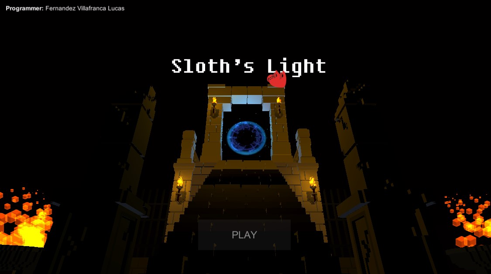
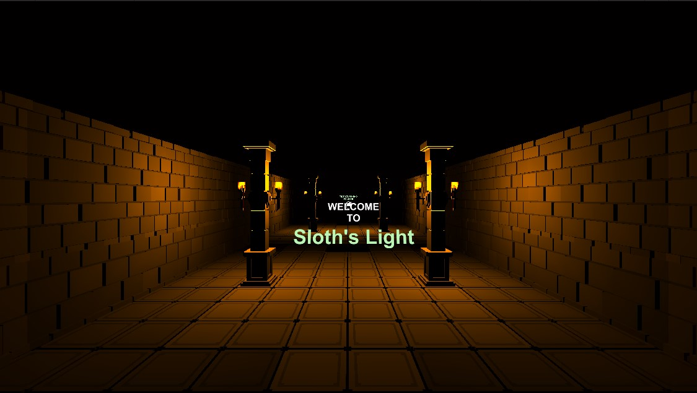
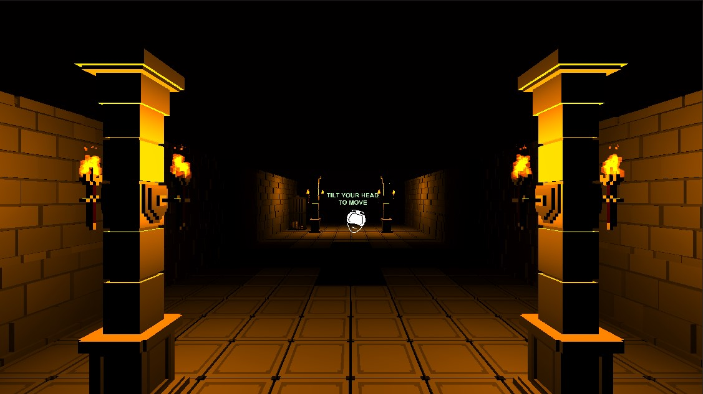

Sloth's Light
===
Sloth's Light is an infinite runner made for Google Carboard VR with UnityEngine.  

This game was done as an assigment to show the integration of AR or VR into a game. Originally made on 2017.  

The art is from Voxel Dungeons pack purchased on the AssetStore.  

## Screenshots

## Repo

On the `project` directory you will find the Unity Project. It's ready to be built for Android or Windows.

## Author

Lucas Fernandez Villafranca
